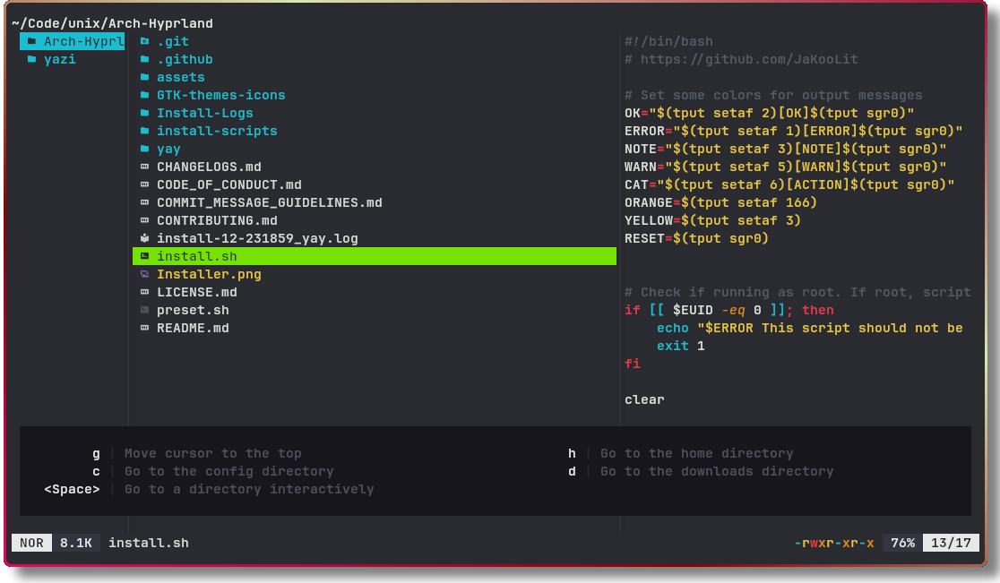

<div align="center">
  
</div>

<h3 align="center">
	Flavor for <a href="https://github.com/sxyazi/yazi">Yazi</a>
</h3>

## Monokai Vibrant
I like Monokai. I like Monokai with vibrant colors and minimal styling even more. Borders are only slightly visible. Kept a lot of things plain white to counteract the colorfulness.

## Theme
Monokai Vibrant Theme based on jonotansberg "tweaked Monokai Dark Soda" .tmTheme. https://github.com/jonatansberg/Monokai-Dark-Soda.tmTheme

## 👀 Preview



## 🎨 Installation

<!-- Please replace "username/example" with your repository name. -->

```bash
ya pack -a sanjinso/monokai-vibrant
```

## ⚙️ Usage

Add the these lines to your `theme.toml` configuration file to use it:

```toml
[flavor]
use = "monokai-vibrant"
```

## 📜 License

The flavor is MIT-licensed, and the included tmTheme is also MIT-licensed.

Check the [LICENSE](LICENSE) and [LICENSE-tmtheme](LICENSE-tmtheme) file for more details.
